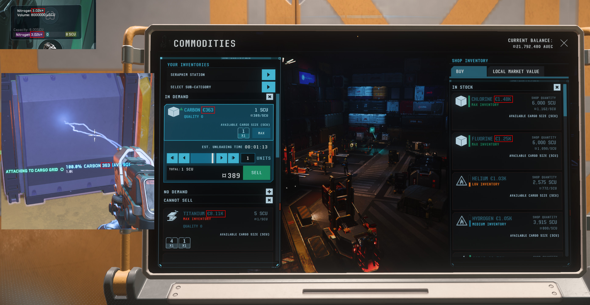

# Star Citizen Commodity Prices

A small Python utility that automatically updates commodity sell prices in a Star Citizen `global.ini` localization file using current data provided by the UEX API.

The script is designed to be run repeatedly. Existing commodity prices are detected and replaced with the latest available sell price instead of being appended repeatedly.

> **Unofficial fan-made software.**
> This project is not affiliated with, endorsed by, sponsored by, or otherwise associated with Cloud Imperium Games, Roberts Space Industries, or UEX.

---

## Features

* Retrieves commodity data from the UEX API.
* Uses the UEX `price_sell` value.
* Updates commodity prices directly in `global.ini`.
* Can be executed repeatedly without accumulating duplicate prices.
* Removes previously generated prices before inserting updated values.
* Adds the currency marker `¤` before the formatted price.
* Supports prices such as:

  * `¤570`
  * `¤3.52k`
  * `¤1.25M`
* Creates a backup of the original `global.ini` before modifying it.
* Supports specifying the `global.ini` directory via a command-line argument.
* Falls back to the directory containing the Python script if no path is supplied.
* Reports commodities whose prices could not be updated.
* Writes the modified file as UTF-8 with BOM.



---

## Example

A commodity entry such as:

```ini
items_commodities_potassium=Potassium
```

may become:

```ini
items_commodities_potassium=Potassium ¤570
```

On a later run, if the current UEX sell price has changed, the existing price is replaced:

```ini
items_commodities_potassium=Potassium ¤625
```

The script does **not** produce:

```ini
items_commodities_potassium=Potassium ¤570 ¤625
```

---

## Requirements

* Python 3.9 or newer
* Internet connection
* A Star Citizen `global.ini` localization file
* Python package:

  * `requests`

Install the dependency with:

```bash
pip install -r requirements.txt
```

The repository contains a `requirements.txt` file with the required Python dependency.

---

## Installation

Clone the repository:

```bash
git clone https://github.com/uselessCookie/sc-commodity-prices.git
cd sc-commodity-prices
```

Install the required Python package:

```bash
pip install -r requirements.txt
```

---

## Usage

### Important: `global.ini` and Language Packages

The `global.ini` file is **not included in a standard Star Citizen installation**.
Before this script can be used, you must install a compatible **language package** that provides the `global.ini` file.

The script cannot modify `global.ini` if the file does not exist in the specified directory.


### global.ini in the same directory as the script

If `global.ini` is located in the same directory as `src/update_prices.py`, simply run:

```bash
python update_prices.py
```

The script automatically uses:

```text
<directory of update_prices.py>/global.ini
```

### Specify the global.ini directory

Use the `-p` / `--path` argument:

```bash
python update_prices.py -p "D:\Games\StarCitizen\LIVE\data\Localization\<language>_(<language>)"
```

The script will then use:

```text
D:\Games\StarCitizen\LIVE\data\Localization\<language>_(<language>)\global.ini
```

The path should point to the **directory containing `global.ini`**, not to the file itself.

For example:

```text
-p "D:\Games\StarCitizen\LIVE\data\Localization\<language>_(<language>)"
```

not:

```text
-p "D:\Games\StarCitizen\LIVE\data\Localization\<language>_(<language>)\global.ini"
```

### Help

To display the available command-line options:

```bash
python update_prices.py --help
```

---

## Backup

Before modifying `global.ini`, the script creates a backup in the same directory.

For example:

```text
global.ini
global.ini.prices.bak
```

If the specified path is:

```text
D:\Games\StarCitizen\LIVE\data\Localization\<language>_(<language>)
```

the backup will be created as:

```text
D:\Games\StarCitizen\LIVE\data\Localization\<language>_(<language>)\global.ini.prices.bak
```

The backup is created using Python's `shutil.copy2()` so that the original file is preserved before modification.

---

## Price Data

This project uses the **UEX API 2.0** to retrieve commodity information.

The relevant API resource is:

```text
GET /commodities
```

UEX provides commodity fields including:

* `name`
* `code`
* `price_buy`
* `price_sell`
* `is_sellable`
* `is_raw`
* `is_refined`
* and other commodity metadata.

This project specifically uses:

```text
price_sell
```

because the displayed value represents the amount received when selling the commodity.

UEX documents commodity prices as being measured per SCU.

Official UEX API documentation:

https://uexcorp.space/api/documentation/

Commodity endpoint documentation:

https://uexcorp.space/api/documentation/id/get_commodities/

UEX Terms of Use and API Terms:

https://uexcorp.space/about/terms

The UEX documentation states that its data is community-maintained/crowdsourced and may not always reflect the current live game state. Therefore, prices generated by this application should be considered informational and may differ from prices currently available in Star Citizen.

---

## UEX Attribution

This project uses data provided by UEX.

UEX is an independent community project and is not affiliated with Cloud Imperium Games.

UEX itself states:

> UEX is a fictional in-game entity and not affiliated with Cloud Imperium Games.

UEX also states that its data is community-maintained and may not reflect live servers.

Please refer to the official UEX documentation and Terms of Use for the current conditions applicable to API usage.

---

## Star Citizen Disclaimer

Star Citizen and related intellectual property are owned by their respective rights holders.

This project is an unofficial community-made tool and is not affiliated with, endorsed by, sponsored by, or otherwise associated with Cloud Imperium Games, Cloud Imperium Rights, or Roberts Space Industries.

**Star Citizen**, **Squadron 42**, **Roberts Space Industries**, **Cloud Imperium**, and related names, logos, characters, game content, and other intellectual property remain the property of their respective owners.

The official Roberts Space Industries fan-content guidance recommends clearly identifying fan projects as unofficial and avoiding any implication of endorsement, sponsorship, or affiliation.

For the current official rules and requirements, see:

https://support.robertsspaceindustries.com/hc/en-us/articles/360006895793-Star-Citizen-Fankit-and-Fandom-FAQ

---

## License

The source code of this project is licensed under the:

**GNU General Public License v3.0 (GPL-3.0)**

See the [`LICENSE`](LICENSE) file for the complete license text.

Copyright (C) 2026 uselessCookie

The GPL-3.0 license applies to the original source code of this project.

It does **not** grant rights to third-party intellectual property, including Star Citizen game content, trademarks, localization content, UEX data, or other material belonging to third parties.

Third-party content and services remain subject to their respective licenses, terms, and usage policies.

---

## Third-Party Services and Dependencies

### UEX API

This application accesses the UEX API to retrieve commodity data.

Website:

https://uexcorp.space/

API documentation:

https://uexcorp.space/api/documentation/

API terms:

https://uexcorp.space/about/terms

UEX may change, modify, remove, or restrict API resources. Users of this application are responsible for complying with the current UEX API Terms of Use. UEX also states that API data accuracy and availability are not guaranteed.

### Python Requests

The application uses the Python `requests` package for HTTP communication.

Requests is an independent third-party open-source project and is not part of this repository.

Please refer to the Requests project for its current license and terms.

---

## Data Accuracy and Liability

This software is provided for convenience and informational purposes.

Neither the author nor this project guarantees that:

* UEX prices are accurate;
* UEX prices represent current in-game prices;
* every commodity can be matched correctly;
* the UEX API will remain available;
* the UEX API format will remain unchanged;
* the resulting `global.ini` will be accepted by every version of Star Citizen;
* modifying `global.ini` will not cause problems with the game or other software.

Always keep the automatically created backup of `global.ini`.

Use this software at your own risk.

The author is not responsible for:

* corrupted or modified game files;
* loss of data;
* game crashes;
* incorrect commodity prices;
* API outages;
* API changes;
* account-related consequences;
* changes to Star Citizen;
* changes to UEX;
* or any other direct or indirect consequences resulting from the use of this software.

---

## API Changes

The UEX API is actively developed and may change over time.

UEX explicitly states that API resources can be modified, updated, deprecated, or removed, and that users are responsible for keeping their applications compatible with the current API.

If the script stops working after an API change, check the current UEX API documentation before opening an issue.

---

## File Encoding

The script reads `global.ini` as UTF-8/UTF-8 with BOM and writes the modified file as:

```text
UTF-8 with BOM
```

This is intentional because some applications may otherwise interpret UTF-8 characters incorrectly.

The script also writes the resulting file using Unix-style LF line endings.

If the original file already contains corrupted text caused by incorrect character encoding, changing the encoding of the output file will not automatically repair the corrupted text.

---

## Contributing

Issues and pull requests are welcome.

When reporting a problem, please include:

* Python version
* Star Citizen version
* UEX API version, if known
* operating system
* relevant console output
* the affected `global.ini` entry, if possible

Do not upload your complete `global.ini` if it contains personal or otherwise sensitive information.

---

## Disclaimer

This is an independent, unofficial community project.

It is not affiliated with or endorsed by:

* Cloud Imperium Games
* Cloud Imperium Rights
* Roberts Space Industries
* UEX Corp

All third-party trademarks, names, game content, data, and other intellectual property remain the property of their respective owners.

Please consult the current terms and policies of the respective rights holders and service providers before using or distributing this software or derivative works.

---

## AI-Assisted Development

Parts of this project were developed with the assistance of AI (OpenAI ChatGPT). All generated code was reviewed and tested by the project author before use.

---

## Links

* Repository: https://github.com/uselessCookie/sc-commodity-prices
* UEX: https://uexcorp.space/
* UEX API Documentation: https://uexcorp.space/api/documentation/
* UEX Terms of Use: https://uexcorp.space/about/terms
* Star Citizen / RSI: https://robertsspaceindustries.com/
* RSI Fan Content Policy: https://support.robertsspaceindustries.com/hc/en-us/articles/360006895793-Star-Citizen-Fankit-and-Fandom-FAQ
* GPL-3.0: https://www.gnu.org/licenses/gpl-3.0.html
